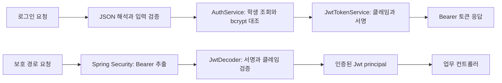

# 로그인과 JWT 인증

상태: 로그인 HTTP API·JWT 발급 및 검증·보호 경로 접근 제어 구현. 검증 결과는 마지막 절에 기록한다. 재발급·로그아웃은 별도 설계 대상이다.

[요구사항 D43~D53·D89](REQUIREMENTS.md)을 구현한다. 기존 초기 데이터의 STUDENT.password_hash와 bcrypt를 사용하며 스키마를 변경하지 않는다. 실제 임시 비밀번호 이메일 발송·최초 설정은 현재 모의 계정 생성과 구분한다.

## 로그인 요청과 응답

```http
POST /auth/login
Content-Type: application/json
```

```json
{"studentNumber":202010100,"password":"example-password"}
```

| 필드 | 조건 |
|---|---|
| studentNumber | 필수 JSON 정수, 100000000~999999999. 숫자 문자열·소수·지수 표기는 거절 |
| password | 필수 문자열. null·빈 문자열·공백만 있는 값은 거절. 앞뒤 공백은 제거하지 않음 |

예시 비밀번호는 설명용이며 초기 계정의 실제 비밀번호가 아니다. 초기 학생 계정은 INITIAL_STUDENT_PASSWORD를 bcrypt로 해시하여 준비한다.

인증 성공 시 200을 반환한다. expiresIn은 초 단위 유효기간이다.

```json
{"accessToken":"<JWT>","tokenType":"Bearer","expiresIn":1800}
```

응답은 Cache-Control: no-store와 Pragma: no-cache를 포함하며 로그인 세션 쿠키를 발급하지 않는다. LoginRequest·LoginResponse의 toString은 비밀번호·토큰을 노출하지 않는다. 요청·응답 본문 및 Authorization 헤더를 애플리케이션 로그에 기록하지 않는다.

## 입력 검증과 오류

JSON 해석 → 필드 값 검증 → 계정 인증 → JWT 발급 순서로 처리한다. JSON 해석 오류는 DTO가 만들어지기 전에 판정한다. 타입이 올바른 요청의 값 오류는 studentNumber → password 순서로 첫 오류 하나를 반환한다. 입력 오류에서는 학생 DB를 조회하지 않는다.

- JSON 객체 하나만 허용한다. 배열·스칼라·잘린 JSON·뒤에 이어지는 다른 JSON은 400이다.
- 중복 필드와 studentNumber·password 외의 필드는 400으로 거절한다.
- 로그인 전용 Jackson 역직렬화기를 사용해 숫자 문자열·소수나 숫자 비밀번호의 자동 변환을 막는다.

초기 계정은 bcrypt가 표현할 수 있는 UTF-8 72바이트 이하의 비밀번호만 허용한다. 로그인에서도 이를 넘는 값은 학생 조회·해시 대조 전에 기존 인증 실패(401)로 거절한다. 글자 수가 아닌 바이트 수를 검사하므로 한글도 같은 경계를 적용한다. 이는 긴 입력의 뒷부분이 잘려 다른 비밀번호가 일치하는 것을 막기 위한 처리이다. [Spring Security 7.1.1 bcrypt 구현](https://github.com/spring-projects/spring-security/blob/7.1.1/crypto/src/main/java/org/springframework/security/crypto/bcrypt/BCrypt.java)을 확인했다.

모든 인증 오류 본문은 code·message 구조이다.

| 상황 | HTTP / code | message |
|---|---|---|
| JSON 구조·타입·중복·지원하지 않는 필드 오류, 본문 누락 | 400 / INVALID_PARAMETER | 잘못된 요청입니다. |
| 학번 누락·null·9자리 범위 오류 | 400 / INVALID_PARAMETER | studentNumber는 필수이며 9자리 정수여야 합니다. |
| 비밀번호 누락·null·빈 값·공백 | 400 / INVALID_PARAMETER | password는 필수이며 공백이 아닌 문자열이어야 합니다. |
| 없는 학번·비밀번호 불일치·UTF-8 72바이트 초과 | 401 / INVALID_CREDENTIALS | 학번 또는 비밀번호가 올바르지 않습니다. |
| 보호 경로의 토큰 누락 | 401 / TOKEN_REQUIRED | 로그인이 필요합니다. |
| 서명·그 밖의 조건은 정상이고 만료된 토큰 | 401 / TOKEN_EXPIRED | 인증이 만료되었습니다. 다시 로그인해주세요. |
| 보호 경로의 그 밖의 토큰·Authorization 검증 실패 | 401 / INVALID_TOKEN | 유효하지 않은 인증 정보입니다. |
| 인증 후 권한 부족 | 403 / FORBIDDEN | 접근 권한이 없습니다. |

현재 업무 접근 조건은 로그인 여부뿐이며 별도 역할·권한 체계는 도입하지 않는다. 403은 권한 거절 발생 시의 공통 응답이다. 토큰 누락에는 WWW-Authenticate: Bearer, 전달된 인증 정보의 실패에는 WWW-Authenticate: Bearer error="invalid_token"을 반환한다. 내부 검증 예외나 토큰 원문은 응답하지 않는다.

## 인증 실패 원인과 진단

검증 실패는 내부 원인으로 분류하고 외부에는 누락·만료·그 밖의 유효하지 않은 토큰으로 변환한다. 클라이언트가 서버에서 발급한 클레임을 수정하게 하지 않고, 누락에는 로그인, 정상 토큰의 만료에는 재로그인을 안내한다. [Bearer 오류 응답 표준](https://www.rfc-editor.org/rfc/rfc6750.html#section-3.1)을 따른다.

- 토큰 구문·허용 알고리즘·서명 검증 후 필수 클레임, 학번, 발급자, 대상, 발급 시각, 유효기간, 사용 시작 시각을 검사한다. 만료 검사는 마지막에 수행한다.
- 만료와 다른 오류가 겹치면 다른 오류를 우선한다. 서명이 틀린 토큰, 발급자가 다른 만료 토큰, 숫자 sub가 문자열로 변환된 만료 토큰은 TOKEN_EXPIRED로 안내하지 않는다.
- 내부 원인은 TOKEN_MISSING, MALFORMED_AUTHORIZATION, MALFORMED_TOKEN, UNSUPPORTED_ALGORITHM, INVALID_SIGNATURE, MISSING_CLAIM, INVALID_SUBJECT, ISSUER_MISMATCH, AUDIENCE_MISMATCH, ISSUED_AT_IN_FUTURE, INVALID_LIFETIME, NOT_YET_VALID, TOKEN_EXPIRED로 구분한다. 분류할 수 없는 검증 실패는 INVALID_TOKEN으로 남긴다.
- 보호 경로 인증 실패 시 서버가 UUID 요청 식별자를 생성해 X-Request-Id 응답 헤더로 전달한다. 요청에서 같은 이름의 헤더를 보내도 재사용하지 않는다. JSON은 기존 code·message 구조를 유지한다.
- 공통 보안 오류 처리기는 `event=JWT_REJECTED reason=<원인> requestId=<응답과 같은 ID>`를 기록한다. 토큰·Authorization 원문, 비밀번호, 비밀키, 클레임 값, 라이브러리 예외 메시지·스택은 이 로그에 포함하지 않는다. [OWASP 로깅 가이드](https://cheatsheetseries.owasp.org/cheatsheets/Logging_Cheat_Sheet.html)를 따른다.

JwtClaimsValidator는 조건별 OAuth2Error를 반환한다. JwtConfiguration은 decoder 단계의 실패와 클레임 실패를 JwtRejectedException으로 연결하고, ApiSecurityErrorHandler가 안전한 진단 기록과 외부 응답을 담당한다. 토큰 누락·헤더 형식 오류는 클레임 validator 전에 실패하므로 공통 handler에서도 분류한다.

## JWT 정책

| 항목 | 발급·검증 기준 |
|---|---|
| 서명 | HS256만 허용. 설정된 같은 비밀키로 발급과 검증 |
| sub | 인증된 학번의 문자열. 0으로 시작하지 않는 9자리 숫자 문자열만 허용 |
| iss | JWT_ISSUER와 일치 |
| aud | JWT_AUDIENCE 포함 |
| iat | 발급 시각. 필수이며 현재 시각보다 미래이면 거절 |
| exp | 필수이며 iat + 1800초. 현재 시각이 exp와 같거나 이후이면 거절 |
| nbf | 발급 시 추가하지 않음. 전달된 토큰에 존재하면 현재 시각부터 사용 가능한지 검사 |

iat·exp는 같은 Instant에서 계산한 Unix 초 단위 숫자이다. 업무상 표시 기준은 KST지만 토큰 숫자에 9시간을 더하지 않는다. `Clock`을 주입해 발급과 검증에서 같은 시간원을 사용하고 테스트에서는 시각을 고정한다. 유효기간은 JwtTokenService.TOKEN_LIFETIME 한 곳에서 관리하여 토큰과 로그인 응답의 1800초가 어긋나지 않게 한다.

Spring Security의 기본 시계 오차 허용은 60초다. 이 시스템은 단일 서버와 정확한 만료 경계를 전제로 하므로 전용 JwtClaimsValidator가 오차 허용 없이 검사한다. 특히 `now < exp` 조건을 사용해 만료 시각과 같은 순간도 거절한다. NimbusJwtDecoder는 HS256 서명을 검증하고, 서명 검증 후 원래 JSON의 sub 타입도 확인해 Nimbus의 숫자 → 문자열 자동 변환으로 잘못된 타입이 허용되지 않게 한다. [Spring Security JWT 검증](https://docs.spring.io/spring-security/reference/servlet/oauth2/resource-server/jwt.html), [JWT NumericDate](https://www.rfc-editor.org/rfc/rfc7519.html#section-2)를 따른다.

## 요청 인증과 공개 경로

```http
Authorization: Bearer <accessToken>
```

| 경로 | 접근 조건 |
|---|---|
| POST /auth/login | 공개. 학번·비밀번호로 인증 |
| GET /health | 공개. 기존 준비 상태에 따라 200 또는 503 |
| 강좌·학생·교수·신청·취소·시간표를 포함한 나머지 경로 | 유효한 Bearer JWT 필요 |

공개 경로는 클라이언트가 오래된 Authorization 헤더를 붙여도 기존 로그인·헬스체크 동작을 수행한다. 보호 경로는 업무 입력 검증 전에 인증한다. 토큰은 Authorization 헤더로만 받으며 쿼리·쿠키·폼으로 대신 전달할 수 없다.

Spring Security의 Resource Server 필터를 사용하고 SessionCreationPolicy.STATELESS를 설정한다. 폼 로그인·HTTP Basic·기본 로그아웃·요청 세션 저장은 사용하지 않는다. 인증이 자동 전송되는 쿠키나 Basic에 의존하지 않으므로 CSRF 검사를 비활성화한다. 향후 쿠키 인증을 도입한다면 이 전제를 다시 검토해야 한다. [세션 관리](https://docs.spring.io/spring-security/reference/servlet/authentication/session-management.html), [CSRF 고려 사항](https://docs.spring.io/spring-security/reference/servlet/exploits/csrf.html)을 확인했다.

검증된 Jwt가 인증 principal이 된다. 업무 컨트롤러는 `@AuthenticationPrincipal Jwt jwt`의 sub로 학생을 식별한다. 매 요청마다 학생의 존재를 다시 조회하지 않는 기존 정책을 유지한다. 발급 후 학생 삭제는 현재 고려 범위 밖이다. 인가를 통과한 뒤 발생한 404·500이 오류 디스패치에서 401로 바뀌지 않도록 ERROR 디스패치를 허용한다.

## 구성과 책임



| 구성 | 책임 |
|---|---|
| LoginRequestDeserializer·LoginRequestValidator | JSON 구조·타입과 필수 값·범위 검증 |
| AuthService | bcrypt 바이트 경계 검사, 기존 학생 조회와 PasswordEncoder.matches 대조 |
| JwtTokenService | 인증된 학번·설정값·30분 만료를 담은 JWT 발급 |
| AuthController | 검증 → 인증 → 발급 순서와 HTTP 성공 응답 연결 |
| JwtConfiguration·JwtClaimsValidator | 키·시계·서명기·검증기 구성과 클레임 정책 |
| SecurityConfiguration | 공개 경로, Bearer 인증과 무상태 접근 제어 |
| JwtFailureReason·JwtRejectedException | 내부 실패 원인과 안전한 예외 전달 |
| ApiExceptionHandler·ApiSecurityErrorHandler | MVC 및 보안 필터의 오류 본문, 인증 실패 로그와 요청 ID |

Spring Boot 4.1.1 BOM의 Spring Security 7.1.1을 사용한다. `spring-boot-starter-security-oauth2-resource-server`로 HTTP 보안과 Resource Server를 구성하며 JWT 발급·검증에 `spring-security-oauth2-jose`를 사용한다. 요청 해석은 Boot 4의 기본 Jackson 3에 맞춘다. [Spring Boot Security](https://docs.spring.io/spring-boot/reference/web/spring-security.html), [Jackson 지원](https://docs.spring.io/spring-boot/reference/features/json.html)을 확인했다.

## 실행 설정

| 환경변수 | 기준 |
|---|---|
| JWT_SECRET_BASE64 | 암호학적 난수 최소 32바이트의 Base64 표현. 기본값 없음 |
| JWT_ISSUER | 개발용 값 course-registration-system |
| JWT_AUDIENCE | 개발용 값 course-registration-api |

필수 값 누락·공백, 잘못된 Base64·짧은 키는 기동 실패로 처리한다. 키는 재시작 시에도 유지하며 원문을 저장소·문서·로그에 기록하지 않는다. JwtProperties의 문자열 표현에서도 키를 숨긴다. [실행과 키 생성 절차](DB_SETUP.md)를 따른다. 테스트는 독립된 공개 테스트 키와 격리된 PostgreSQL을 사용하며 개발 DB와 비밀키를 사용하지 않는다.

## 구현 범위와 후속 설계

- 이번 범위는 초기 계정 기반 로그인, JWT 발급·검증, 보호 경로의 인증 제한이다.
- 토큰 재발급·로그아웃은 별도 설계한다. 갱신 기간·기존 토큰 처리·서버 측 무효화 저장소를 도입하지 않았다.
- 이메일 초기 설정, 비밀번호 변경·재설정, 키 교체·유출 대응, 로그인 시도 제한과 배포 HTTPS 구성은 후속 대상이다.
- 강좌·학생·교수 목록과 신청·취소·시간표의 업무 로직은 후속 PR이다. 인증 테스트용 보호 경로는 test 소스에만 존재하며 실제 업무 API의 완성을 의미하지 않는다.

## 검증

2026-09-20, Java 25·Spring Boot 4.1.1·Spring Security 7.1.1·Testcontainers PostgreSQL 18.6에서 실행했다.

```powershell
.\gradlew.bat test bootJar --no-daemon
```

비밀번호 바이트 경계 보완 전 전체 **300개 테스트가 통과**했다. 실패·오류·건너뜀 0, bootJar 성공이며 22개 클래스 실행에 6분 31초가 걸렸다. 당시 인증 96개와 기존 스키마·초기 데이터·준비 상태 204개를 함께 실행했다.

추가 AI 검토에서 발견한 bcrypt 경계를 보완한 뒤 아래 명령으로 영향 범위인 인증 **102개를 재실행해 모두 통과**했다. 실패·오류·건너뜀 0, bootJar 성공, 실행 시간은 3분 6초이다. 두 실행에는 같은 테스트가 포함되므로 합산하지 않는다.

```powershell
.\gradlew.bat test --tests 'com.doroddi.courseregistration.student.auth.*' --tests 'com.doroddi.courseregistration.config.JwtConfigurationTest' bootJar --no-daemon
```

아래 표는 보완 후 인증 재검증 결과이다.

| 테스트 | 실행 수 | 확인 내용 |
|---|---:|---|
| AuthIntegrationTest | 75 | 실제 PostgreSQL 계정과 HTTP 로그인, 엄격한 JSON과 DB 조회 차단, 비밀번호 공백·ASCII/한글 바이트 경계, JWT 서명·클레임·만료 경계, 보호 경로와 principal, 무상태 인증, 공개 경로와 오류 디스패치 |
| AuthServiceTest | 9 | 비밀번호 대조, 없는 학번·불일치의 공통 실패, 원문 공백 보존, ASCII·한글 UTF-8 72바이트 경계와 초과 시 의존성 호출 차단 |
| JwtTokenServiceTest | 4 | 실제 서명, 필수 클레임·1800초, UTC·KST 동일 순간, 호출별 시각과 학번, 서명 실패 전파 |
| JwtConfigurationTest | 14 | 설정 바인딩, 키 길이, 누락·공백·잘못된 Base64의 기동 실패, 다른 키 거절 |

AuthIntegrationTest는 4개 테스트 학생 계정을 실제 DB에 저장하고 실제 HTTP 서버를 호출한다. 보안 필터·JWT 발급·서명 검증·bcrypt는 실제 구현을 사용한다. 시계만 테스트에서 고정하며 학생 Repository는 실제 동작을 유지한 Spy로 호출 유무를 확인한다. 테스트용 보호 경로에서 sub가 principal로 전달되고 추가 학생 조회나 요청 학번으로의 변경이 없는지 확인했다.

최초 전체 실행은 숫자 sub가 자동 변환되어 허용되는 사례 1개가 실패했다. 서명 검증 후 원래 JSON 타입을 확인하도록 수정하고 위 전체 실행에서 통과했다.

| 요구사항 연결 | 검증 범위 |
|---|---|
| T65·T66·T71~T74 | 로그인 성공·실패와 입력, 필수 클레임, 정확한 만료 경계 |
| T69 | JWT의 UTC·KST 동일 순간. 업무 수업 시간 표시 검증은 별도 |
| T67·T89 | 업무 예정 경로의 인증 차단과 입력보다 먼저 실행되는 공통 보안 필터 |
| T64·T68 | 검증된 principal 전달까지 확인. 실제 신청·취소·시간표의 본인 대상 처리는 업무 구현 후 검증 |
| T70 | 강좌 목록 성공 응답은 목록 API 구현 후 검증 |
| T117~T120 | 부정 JSON·클레임·서명·전달 방식, 세션 비사용, 공개 경로와 404 유지 |

생성한 실행 JAR에서 인증 코드와 Spring Security 7.1.1 의존성을 확인했다. 테스트용 ProtectedProbe와 테스트 application.properties는 포함되지 않았다. 이 확인은 JAR 구성 검사이며, 배포 환경의 HTTPS·운영 부하 검증을 뜻하지 않는다.

이전 단위 검증에서는 AuthService 5개, JWT 설정을 포함한 선택 테스트 28개, 발급 서비스를 포함한 선택 테스트 24개가 각각 통과했다. 위 전체 실행과 중복되므로 합산하지 않는다. [AI 자체 검토](reviews/auth-ai-review.md)와 [PR 본문 초안](reviews/auth-pr.md)에 변경 의도와 후속 범위를 정리했다.
## 인증 실패 진단 검증

2026-09-20, 인증 실패 응답과 내부 진단을 분리한 뒤 실행했다.

```powershell
.\gradlew.bat test --tests 'com.doroddi.courseregistration.student.auth.*' --tests 'com.doroddi.courseregistration.config.JwtConfigurationTest' bootJar --no-daemon
```

인증 관련 **157개 통과**, 실패·오류·건너뜀 0, bootJar 성공. 6개 테스트 클래스가 실행됐으며 전체 명령은 2분 47초가 걸렸다. 이번 실행은 인증 변경의 영향 범위에 대한 검증이며 이전 전체·선택 실행 결과와 합산하지 않는다.

| 테스트 | 실행 수 | 확인 내용 |
|---|---:|---|
| AuthIntegrationTest | 80 | 실제 HTTP·PostgreSQL 로그인과 인증 회귀, 외부 실패 코드·헤더, 만료와 다른 오류 중첩, 서버 생성 요청 ID |
| JwtFailureDiagnosticsTest | 31 | 실제 HS256 서명·고정 시계로 필수 클레임 누락, 원본 sub 타입, 발급자·대상·시간·유효기간·서명 오류의 내부 원인과 우선순위 |
| ApiSecurityErrorHandlerTest | 19 | 내부 원인→외부 응답 매핑, resolver와 decoder 실패 구분, 응답·로그 ID 일치, 클라이언트 ID 미사용, 원문·예외 스택 미기록 |
| AuthServiceTest | 9 | 비밀번호 대조·공통 실패·공백·bcrypt 바이트 경계 회귀 |
| JwtTokenServiceTest | 4 | 기존 발급·서명·시각 정책 회귀 |
| JwtConfigurationTest | 14 | 기존 필수 설정·키 길이·잘못된 키 처리 회귀 |

요구사항 T66·T118·T121의 만료·실패 진단 사례를 검증했다. 실행 JAR에 새 인증 진단 코드가 포함되고 테스트 전용 경로·클래스·설정은 포함되지 않았음을 확인했다. 검증한 8개 운영·테스트 변경 파일은 테스트 실행 중 변경되지 않았다.
