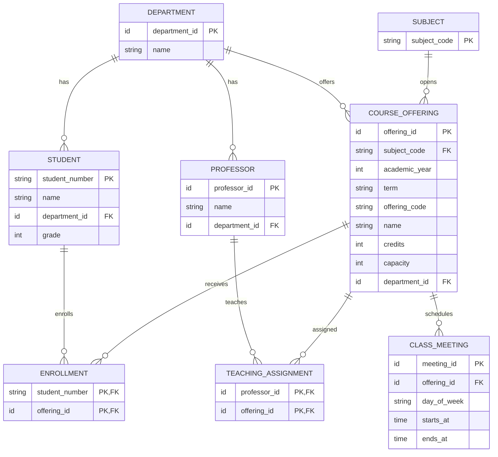

# 데이터 모델 및 ERD 초안

관련 기준: [요구사항](REQUIREMENTS.md). 논리 모델이며 DDL·JPA 매핑·물리 타입은 아직 확정하지 않았다. 아래 `string`, `int`, `time`은 의미를 설명하는 표기이며 DB 타입 지정이 아니다.

## 관계

자식 쪽의 `0..N`은 관련 행을 여러 개 가질 수 있음을 나타낸다. 개설 강좌에 필요한 최소 수업 시간·담당 교수 수는 미정이며, 0개인 강좌를 신청 가능하게 하기로 결정한 것은 아니다.

## 각 테이블을 두는 이유

| 테이블 | 저장하는 사실 | 결정 상태 |
|---|---|---|
| DEPARTMENT | 학생·교수의 소속 및 강좌 개설 학과 | 분리 확정. ID·이름은 초안 필드 |
| STUDENT | 변하지 않는 학번과 이름·학과·학년 | 확정 |
| PROFESSOR | 교수 정보와 하나의 소속 학과 | 관계 확정. ID·이름은 초안 필드 |
| SUBJECT | 학기·분반과 독립된 과목 식별 | 과목 코드 사용 확정. 코드 PK는 초안 제안 |
| COURSE_OFFERING | 특정 연도·학기의 분반, 이름·학점·정원·개설 학과 | 확정 |
| CLASS_MEETING | 한 개설 강좌의 요일별 수업 구간 | 분리 확정. 별도 시간 ID는 초안 제안 |
| ENROLLMENT | 학생과 개설 강좌 사이의 현재 신청 관계 | 관계·취소 시 삭제 확정. 두 FK를 복합 PK로 쓰는 것은 초안 제안 |
| TEACHING_ASSIGNMENT | 교수와 개설 강좌의 담당 관계 | N:M 확정. 두 FK를 복합 PK로 쓰는 것은 초안 제안 |

과목명까지 SUBJECT에 저장할지, 개설 강좌 이름과 어떻게 구분할지는 미정이다. 현재 초안은 COURSE_OFFERING에 강좌명을 두고 SUBJECT에는 식별 코드를 표시한다. 학점이 모든 분반·학기에서 동일하다는 가정은 두지 않는다.

## 식별자와 제약조건

- 학번은 유일하고 불변이다. 숫자처럼 보이더라도 선행 0 등 표현 보존 여부를 확인한 뒤 물리 타입을 정한다.
- 개설 강좌는 별도 PK를 사용하고 `(academic_year, term, offering_code)`는 UNIQUE이다.
- 수강신청의 `(student_number, offering_id)`와 강의 담당의 `(professor_id, offering_id)`는 각각 유일해야 한다. 복합 PK 대신 별도 PK와 UNIQUE를 사용하는 구현도 검토할 수 있다.
- 모든 관계에는 외래 키를 둔다는 초안이다. 학생·강좌 등 부모 데이터의 삭제 및 CASCADE 정책은 미정이다.
- 교수 소속 학과와 강좌 개설 학과가 같아야 한다는 제약은 없다.
- `starts_at < ends_at`은 자정을 넘기지 않는 수업 범위를 채택할 경우의 CHECK 후보이다. 요일·학기·학년·학점·정원 범위의 허용 값은 별도 확정한다.

## DB 키만으로 보장되지 않는 규칙

수강신청의 학생·강좌 조합을 유일하게 해도 다른 분반의 offering_id는 다르므로 동일 과목 중복은 막지 못한다. 이 검사는 개설 강좌의 연도·학기·과목 코드까지 따라가야 한다. 동시 요청에서도 보장할 방법은 트랜잭션 설계 때 결정한다.

정원, 학점 합, 여러 행 사이의 시간 충돌 역시 이 ERD만으로 보장되지 않는다. 중복 검사를 한 뒤 INSERT하는 단순 순서만으로 충분하다고 가정하지 않는다.

## 조회와 변경 예시

| 기능 | 관계를 사용하는 방법 |
|---|---|
| 학과별 강좌 목록 | COURSE_OFFERING.department_id로 필터하고 시간·담당 교수 조회 |
| 현재 신청 인원 | ENROLLMENT를 강좌별로 집계할 수 있음. 별도 카운터 저장 여부는 미정 |
| 신청 | 대상 학기와 정책을 검사한 뒤 ENROLLMENT 생성. 원자성 보장 방법은 후속 설계 |
| 시간표 | 학생의 ENROLLMENT → 대상 학기 COURSE_OFFERING → CLASS_MEETING |
| 취소 | 해당 ENROLLMENT만 제거. 이미 없으면 추가 변화 없이 성공 |

한 강좌에 수업 시간 둘, 교수 둘이 있을 때 모두 한 번에 JOIN하면 네 행이 생길 수 있다. 이 결과에서 신청 인원을 단순 COUNT하면 중복 집계할 위험이 있으므로 인원 집계와 컬렉션 조회 방법은 구현 시 검토한다.

## 검토 순서

1. 테이블별 의미와 관계가 확정 정책을 표현하는지 확인한다.
2. 미정 필드·범위·식별자 제안을 확정한다.
3. API의 요청·성공·오류 계약을 정한다.
4. 실제 DB를 기준으로 트랜잭션·동시성 전략을 비교하고 DDL 및 테스트로 검증한다.
