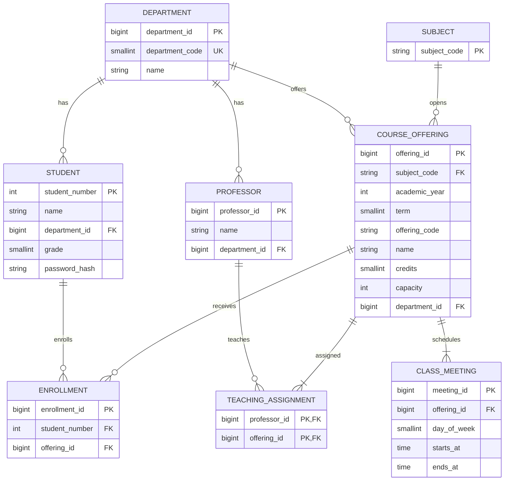

# 데이터 모델 및 ERD

관련 기준: [요구사항](REQUIREMENTS.md). 학번은 INTEGER·Java Integer(D34), 생성 ID는 BIGINT·Java Long(D76)으로 확정했다. 관계·삭제·스키마 관리 방침은 D78을 따른다. 물리 타입·길이·생성 방식·인증 정보 위치·초기 인덱스는 D79~D83을 따른다.

## 관계

개설 강좌의 수업 시간과 강의 담당 연결은 각각 최소 1개이다(D77). 이 최소 개수는 단순 FK만으로 보장되지 않으며 데이터 구성 검증은 후속 구현 대상이다. 현재 V1~V9와 엔티티·Repository의 검증 범위는 [DB 검증 기록](DB_SETUP.md)을 따른다.

## 각 테이블을 두는 이유

| 테이블 | 저장하는 사실 | 결정 상태 |
|---|---|---|
| DEPARTMENT | 학생·교수의 소속 및 강좌 개설 학과 | 분리·증가 BIGINT PK 확정. 이름은 VARCHAR(100) |
| STUDENT | 변하지 않는 학번과 이름·학과·학년(1~4) | 확정 |
| PROFESSOR | 교수 정보와 하나의 소속 학과 | 관계·증가 BIGINT PK 확정. 이름은 VARCHAR(100) |
| SUBJECT | 학기·분반과 독립된 과목 식별 | 과목 코드 사용 확정. 숫자 문자열 VARCHAR(30) PK 확정(D79, D82) |
| COURSE_OFFERING | 특정 연도·학기의 분반, 이름·학점·정원·개설 학과 | 확정 |
| CLASS_MEETING | 한 개설 강좌의 요일별 수업 구간 | 분리·증가 BIGINT PK 확정 |
| ENROLLMENT | 학생과 개설 강좌 사이의 현재 신청 관계 | 증가 BIGINT enrollment_id PK와 학생·강좌 UNIQUE, 취소 시 삭제 확정 |
| TEACHING_ASSIGNMENT | 교수와 개설 강좌의 담당 관계 | N:M 관계를 별도 엔티티로 표현. 두 FK의 복합 PK 확정 |

SUBJECT에는 과목 코드 PK를 두고 COURSE_OFFERING에 강좌명과 학점을 저장한다(D82). 학점이 모든 분반·학기에서 동일하다는 가정은 두지 않는다.

## 식별자와 제약조건

- 학번은 유일하고 불변이며 연도 4자리 + 발급 당시 학과 코드 2자리 + 학생 인덱스 3자리의 고정 9자리 숫자이다(D33). 학생 PK와 수강신청의 학번 FK는 DB INTEGER를 사용한다. Java에서는 Integer, API에서는 JSON 숫자로 표현한다(D34). 초기 데이터는 연도 2020~2026, 학생 인덱스 100~499를 사용한다. 현재 소속은 학번에서 추출하지 않고 department_id로 조회하며 전과 후에도 학번은 유지한다. 학과 코드는 별도 SMALLINT 필드로 관리하고 10~99 범위·필수·유일 제약을 적용한다(D86).
- 개설 강좌는 별도 PK를 사용하고 `(academic_year, term, offering_code)`는 UNIQUE이다.
- 수강신청의 `(student_number, offering_id)`와 강의 담당의 `(professor_id, offering_id)`는 각각 유일해야 한다. 신청은 별도 BIGINT PK와 UNIQUE, 강의 담당은 두 FK의 복합 PK를 사용한다(D76).
- 관계는 외래 키로 표현하고 참조되는 부모 삭제는 제한한다(D78). 취소는 신청 행만 명시적으로 삭제한다.
- 교수 소속 학과와 강좌 개설 학과가 같아야 한다는 제약은 없다.
- 수업은 분 단위로 같은 날 시작·종료하며 starts_at < ends_at을 요구한다. 학년은 1~4(D39), 학기는 1·2, 학점은 정수 1~6, 정원은 양의 정수이다(D77). 요일은 SMALLINT(월=1~일=7)로 저장한다(D80).

## DB 키만으로 보장되지 않는 규칙

수강신청의 학생·강좌 조합을 유일하게 해도 다른 분반의 offering_id는 다르므로 동일 과목 중복은 막지 못한다. 이 검사는 개설 강좌의 연도·학기·과목 코드까지 따라가야 한다. 학생 행 잠금과 잠금 후 검증으로 동시 요청을 보호한다(D64, D75).

정원, 학점 합, 여러 행 사이의 시간 충돌 역시 이 ERD만으로 보장되지 않는다. 중복 검사를 한 뒤 INSERT하는 단순 순서만으로 충분하다고 가정하지 않는다.

## 조회와 변경 예시

| 기능 | 관계를 사용하는 방법 |
|---|---|
| 학과별 강좌 목록 | COURSE_OFFERING.department_id로 필터하고 시간·담당 교수 조회 |
| 현재 신청 인원 | ENROLLMENT를 강좌별로 집계할 수 있음. 별도 카운터 대신 COUNT 사용 확정(D65) |
| 신청 | 대상 학기와 정책을 검사한 뒤 ENROLLMENT 생성. 검사·잠금·저장을 같은 트랜잭션에서 수행(D64~D65) |
| 시간표 | 학생의 ENROLLMENT → 대상 학기 COURSE_OFFERING → CLASS_MEETING |
| 취소 | 해당 ENROLLMENT만 제거. 이미 없으면 추가 변화 없이 성공 |

한 강좌에 수업 시간 둘, 교수 둘이 있을 때 모두 한 번에 JOIN하면 네 행이 생길 수 있다. 이 결과에서 신청 인원을 단순 COUNT하면 중복 집계할 위험이 있으므로 인원 집계와 컬렉션 조회 방법은 구현 시 검토한다.

## 검토 순서

1. 테이블별 의미와 관계가 확정 정책을 표현하는지 확인한다.
2. 미정 필드·범위·식별자 제안을 확정한다.
3. API의 요청·성공·오류 계약을 정한다.
4. 실제 DB를 기준으로 트랜잭션·동시성 전략을 비교하고 DDL 및 테스트로 검증한다.

수업 요일·시작·종료 시각은 KST(Asia/Seoul)를 기준으로 해석한다(D49). 수업 시각은 TIME WITHOUT TIME ZONE을 사용하며, JWT의 Unix 시간 표현과 구분한다.

시간표는 학생·학기로 필터한 뒤 ENROLLMENT.enrollment_id 오름차순으로 반환한다(D63, D66). 증가 ID는 학생 잠금 안에서 조건을 통과한 신청 저장 시 발급하며 취소 후 재신청은 새 ID를 사용한다. 신청 PK는 D76에 따라 증가 BIGINT ID이며 생성 구문은 D81을 따른다.

[신청·취소 동시성 설계](CONCURRENCY_DESIGN.md)에 D64~D66의 확정 사항과 구현 제안을 구분한다.

JPA 매핑은 필요한 방향의 ManyToOne(LAZY)을 사용한다(D78). 예를 들어 Enrollment는 Student와 CourseOffering을 참조하며, 부모의 신청 컬렉션은 필요한 경우에만 추가한다. API는 DTO를 반환한다. Flyway로 DDL을 관리하고 ddl-auto=validate로 매핑을 확인한다.

학과명은 시스템 내에서 유일하며 DEPARTMENT.name에 UNIQUE를 둔다(D84). PK는 내부 식별을 담당하고 학과명 유일성은 사용자에게 표시되는 이름의 중복을 방지한다. 앞뒤 공백 처리 정책은 별도 결정한다.

D86에 따라 V10과 Department.code에 10~99의 유일한 학과 코드를 반영했다. 기존 department_id와 FK는 유지한다. V10은 기존 학과 행이 없는 DB를 전제로 하며 데이터가 있는 이전 스키마의 코드 이행은 별도 작업이다.
